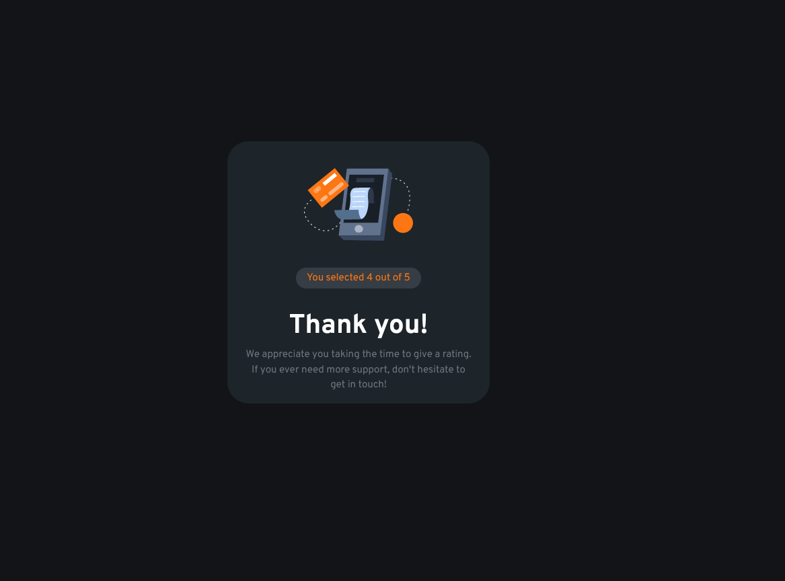
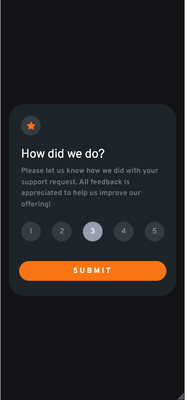
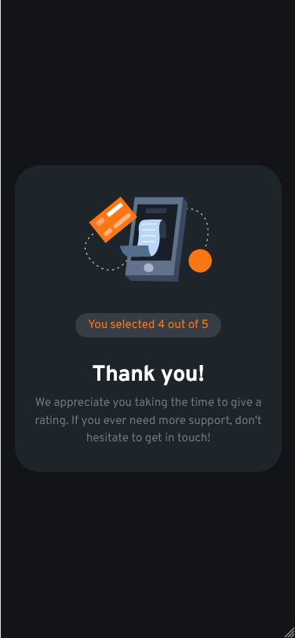

# Frontend Mentor - Interactive rating component solution

This is a solution to the [Interactive rating component challenge on Frontend Mentor](https://www.frontendmentor.io/challenges/interactive-rating-component-koxpeBUmI). Frontend Mentor challenges help you improve your coding skills by building realistic projects.

## Overview

### The challenge

Users should be able to:

- View the optimal layout for the app depending on their device's screen size
- See hover states for all interactive elements on the page
- Select and submit a number rating
- See the "Thank you" card state after submitting a rating

### Screenshot

### Links

- Solution URL: [GitHub URL](https://github.com/PaulaDuduta/interactive-rating-component)
- Live Site URL: [Vercel URL](https://interactive-rating-component-i4in.vercel.app/)

## My process

### Built with

- JavaScript
- Semantic HTML5 markup
- CSS custom properties
- Flexbox
- CSS Grid
- Mobile-first workflow
- Bootstrap

## Author

- LinkedIn - [Paula Pintilie](https://www.linkedin.com/in/paula-duduta-dev/)
- Frontend Mentor - [@PaulaDuduta](https://www.frontendmentor.io/profile/PaulaDuduta)
- GitHub - [@PaulaDuduta](https://github.com/PaulaDuduta)
